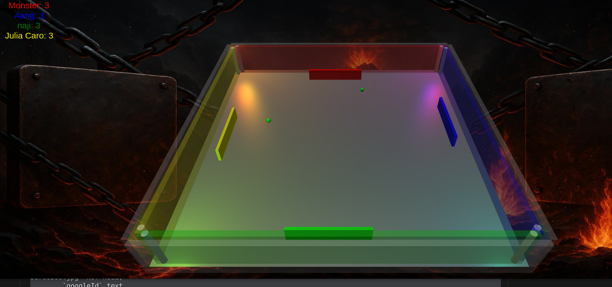

# ft_transcendence (Pong Game)
A 3D real-time multiplayer Pong game with tournament management, built with a **backend-authoritative architecture** ensuring fair gameplay and cheat prevention.

## 📋 Table of Contents

- [Features](#-features)
- [Technology Stack](#-Tech-Stack)
- [Project Architecture](#-project-architecture)
- [Project Structure](#-Project-Architecture)
- [Getting Started](#-Getting-Started)
- [Workspace Structure](#Workspace-Structure)
- [Authors](#-Authors)
- [Screenshots](#-Screenshots)

---

## ✨ Features

### 🔐 Authentication & User Management
- **Email/Password Authentication** - Secure user registration and login with Argon2 password hashing
- **Google OAuth Integration** - Sign in with Google account
- **JWT-based Sessions** - Stateless authentication with token-based security
- **2FA Support** - two-factor authentication for enhanced security
- **User Profiles** - Customizable player profiles with avatars
- **Friend System** - Add and manage friends
- **Active Status** - Show online/offline status of users

### 🎮 Real-time Gameplay
- **3D Pong Game** - Immersive 3D gameplay powered by Babylon.js
- **2-6 Player Support** - Flexible player count per match
- **Backend-Authoritative Logic** - All game state managed server-side for fair play
- **Real-time Synchronization** - Smooth gameplay with tRPC WebSocket subscriptions
- **Lives System** - Track player lives and elimination
- **Physics-based Ball Movement** - Realistic ball physics and collision detection
- **Player Actions** - Responsive paddle controls (up, down, ready states)

### 🔐 Security

- **Password Hashing** - Argon2 with secure defaults
- **JWT Authentication** - Stateless token-based auth
- **Input Validation** - Zod schemas validate all inputs
- **Backend-Authoritative** - All game logic server-side to prevent cheating
- **CORS Protection** - Configured for security
- **SQL Injection Prevention** - Drizzle ORM with parameterized queries

### 🏆 Tournament Management
- **Create Tournaments** - Set up tournaments with customizable player limits (2-6 players)
- **Join Tournaments** - Browse and join available tournaments
- **Tournament Brackets** - Automatic bracket generation and progression
- **Match Scheduling** - Organized match flow within tournaments
- **Real-time Status Updates** - Live tournament status (waiting, ready, ongoing, finished)

### 📊 Statistics & Social
- **Match History** - Track past games and performance
- **Player Statistics** - View wins, losses, and tournament placements

---

## 🛠 Tech Stack

### **Frontend**
- **[SvelteKit](https://kit.svelte.dev/)** - Modern, reactive UI framework
- **[Babylon.js](https://www.babylonjs.com/)** - Powerful 3D rendering engine for game graphics
- **[TailwindCSS](https://tailwindcss.com/)** - CSS framework
- **[tRPC Client](https://trpc.io/)** - End-to-end type-safe API client

### **Backend**
- **[Fastify](https://fastify.dev/)** - High-performance Node.js web framework
- **[tRPC](https://trpc.io/)** - Type-safe API with WebSocket support for real-time features
- **[Drizzle ORM](https://orm.drizzle.team/)** - TypeScript ORM with excellent type inference
- **[SQLite](https://www.sqlite.org/)** - Lightweight, serverless database
- **[Argon2](https://github.com/ranisalt/node-argon2)** - Industry-standard password hashing
- **[JWT](https://jwt.io/)** - Secure token-based authentication
- **[Zod](https://zod.dev)** - Validates and parses inputs 

### **Development Tools**
- **pnpm** - Fast, disk-efficient package manager with workspace support
- **TypeScript** - Type safety across the entire stack
- **ESLint** - Code quality and consistency
- **Prettier** - Code formatting
- **Drizzle Kit** - Database migrations and schema management

### **Infrastructure**
- **Monorepo Architecture** - Organized workspace with shared packages
- **Docker** - Containerized deployment
- **Caddy** - Modern reverse proxy

---

## 🏗 Project Architecture

### **Architectural Principles**

1. **Backend-Authoritative Game Logic** - All game state and physics calculations happen on the server
2. **Type Safety Everywhere** - Shared TypeScript types across frontend and backend
3. **Real-time via tRPC** - WebSocket subscriptions for live game updates, mutations for player actions
4. **Service Layer Pattern** - Clean separation of business logic from API routes
5. **Monorepo Benefits** - Shared packages for consistency and code reuse

### **Real-time Communication**

- **Player Actions** → Sent via tRPC mutations (HTTP)
- **Game State Updates** → Broadcast via tRPC subscriptions (WebSocket)
- **No separate WebSocket server** - tRPC handles all real-time communication


## 🚀 Getting Started

<details>
<summary><strong>Prerequisites</strong></summary>
<details>

<summary>📦 <strong>Production</strong></summary>

- **Docker**

</details>

<details>
<summary>🛠 <strong>Development</strong></summary>

- **Node.js** v22.x or higher
- **pnpm** v8.x or higher

</details>
</details>
<details><summary><strong>Installation</strong></summary>

1. **Clone the repository**

  ```bash
    git clone https://github.com/Soepgroente/transcendence.git
    cd transcendence
  ```

2. **Set up environment variables**

Create `.env` file in `apps/backend/` && `apps/frontend/`:
- Reference `.env.example` in each respective directory for required variables
</details>
<details><summary><strong>Running the Application</strong></summary>

### Run Production version with Docker
  ```bash
  ./run.sh  #for help menu
  ```
**Access the application**
- Frontend: http://hostIpAddress || localhost:9000

</details>

<details><summary><strong>Development version</strong></summary>
after cloning the repo, from the root directory run and setup env files as mentioned above:

### Install all dependencies
``` bash 
pnpm install
pnpm --filter backend db:push
pnpm dev
```
- Frontend: http://localhost:3000
- Backend: http://localhost:4000

</details>

---

## **Workspace Structure**

The project uses **pnpm workspaces** for monorepo management:

- `apps/*` - Deployable applications (backend, frontend, cli)
- `packages/*` - Shared code (db, trpc-contract, tsconfig)
- `infra` - Caddy file

---

## 👥 Authors
The project was developed by the following contributors:
- [Alex](https://github.com/alexkasiot)
- [Julia](https://github.com/julicaro31)
- [Naji](https://github.com/Naji-k)
- [Vincent](https://github.com/Soepgroente)

---

## 📸 Screenshots



---

## check the docs for more info:

- **[Database schema](./docs/dbSchema.png)**
- **[Project Commands](./docs/Project%20Commands.md)**
- **[Monorepo Guide](./docs/Monorepo%20Guide.md)**
- **[Game Architecture](./docs/Game%20Architecture.md)**

---
